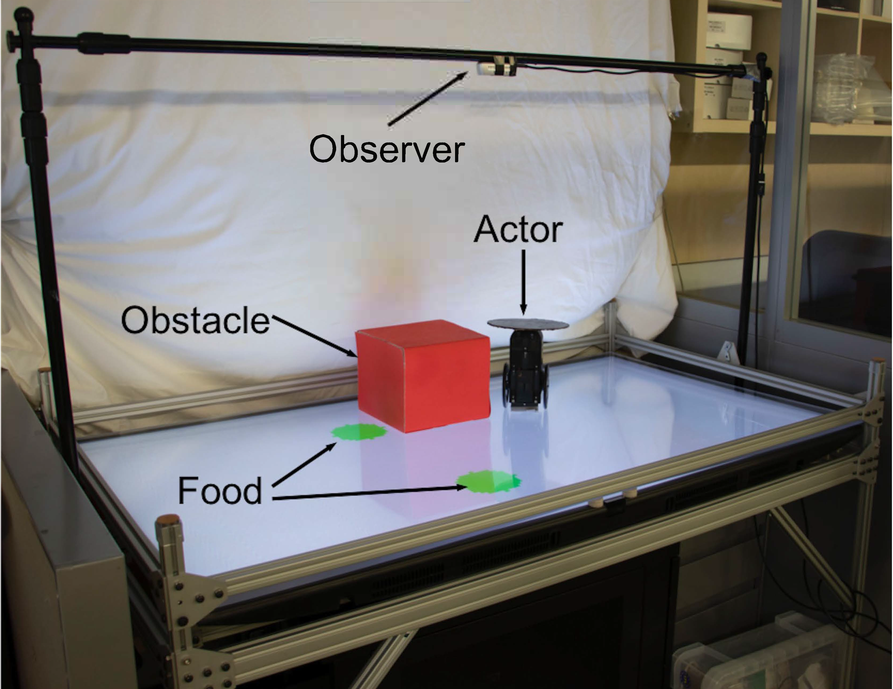

# Visual Behavior Modelling for Robotic Theory of Mind

[Boyuan Chen](http://boyuanchen.com/),
[Carl Vondrick](http://www.cs.columbia.edu/~vondrick/),
[Hod Lipson](https://www.hodlipson.com/),
<br>
Columbia University
<br>
[Scientific Reports](https://www.nature.com/srep/)

### [Project Website](http://www.cs.columbia.edu/~bchen/rtob) | [Video](https://youtu.be/rMl0vacvajo) | [Paper (Coming soon!)]

## Overview
This repo contains the PyTorch implementation for paper "Visual Behavior Modelling for Robotic Theory of Mind".

<br>

<br>

## Content

- [Installation](#installation)
- [Data Preparation](#data-preparation)
- [Training](#training)
- [Testing](#testing)
- [Evaluation](#evaluation)

## Installation

The installation has been test on Ubuntu 16.04 with CUDA 9.0. All the experiments are performed on two TITAN X Nvidia GPUs. The training time varies across different computational platform. In our case, the training typically takes a few hours (less than 5 hours).

We suggest to use a virtual environment for using this code base.
```
cd visual_behavior_modeling
virtualenv -p /usr/bin/python3.6 env
source env/bin/activate
./install_dep.sh
```

## Data Preparation

Please donwload all the dataset from [here](https://drive.google.com/open?id=1YGiw69bvYr4B-_ReDPGQa86zm9rjsM84). To use any downloaded data, please move the downloaded folder under the current directory, unzip it, and rename it as final_data.


## Training

Run the following command to train the network:
```
python3 main_policy_idx.py
```

The pretrained networks can be downloaded [here](http://www.cs.columbia.edu/~bchen/). For training each indiviual policies, we will release more details on how to use it easily. For now, please refer to data_processor, main.py and each individual data file in the data download link.

For the two food policy, please download the dataset from the download link. Rename it to final_data and put the folder under the current directory. Then run the following command:
```
python3 main.py
```

## Testing

Run the following comamnd to visualize the testing result. You may need to change the directory based on your local environment setup.
```
python3 viewer.py
```
The logged visualizations will be saved in test_results/images. The format is left: input; middle: groundtruth output; right: prediction.

## Evaluation

For quantitative evaluations, please refer to the folder evaluation. We provide quantitative evaluation matrix for each individual policy. For details, please refer to our paper. Run the following commands to evaluate the performance for each individual policy. Please remember to copy the test_results folder generated from training step under /evaluation directory.
```
cd evaluation
python3 straight.py
python3 bezier3.py
python3 bezier4.py
python3 obs_one_food.py
python3 obs_two_food.py
```

## BibTeX
```
@article{chen2020visual,
  title={Visual Behavior Modelling for Robotic Theory of Mind},
  author={Chen, Boyuan and Vondrick, Carl and Lipson, Hod},
  journal={Scientific reports},
  year={2020},
  publisher={Nature Publishing Group}
}
```

## License

This repository is released under the MIT license. See [LICENSE](LICENSE) for additional details.

## Acknowledgement

- This project is supported by DARPA MTO grant HR0011-18-2-0020 and NSF NRI 1925157.The authors would like to thank Yinuo Qin, Jonathan Blutinger, Boxi Xia, Philippe Wyder, and Xiaotian Hu for helping with setting up experiments and useful discussions.

- The training monitoring module is borrowed from: https://github.com/bearpaw/pytorch-classification.


## Contact

Please feel free to reach out [Boyuan Chen](http://boyuanchen.com/) if you have any questions about our paper or the code usage.